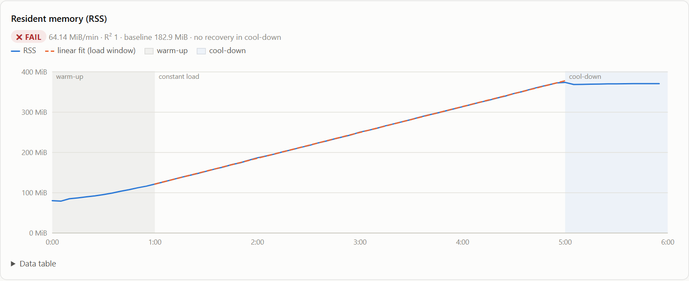
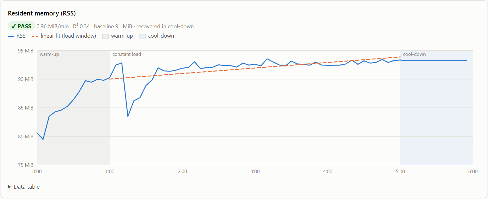
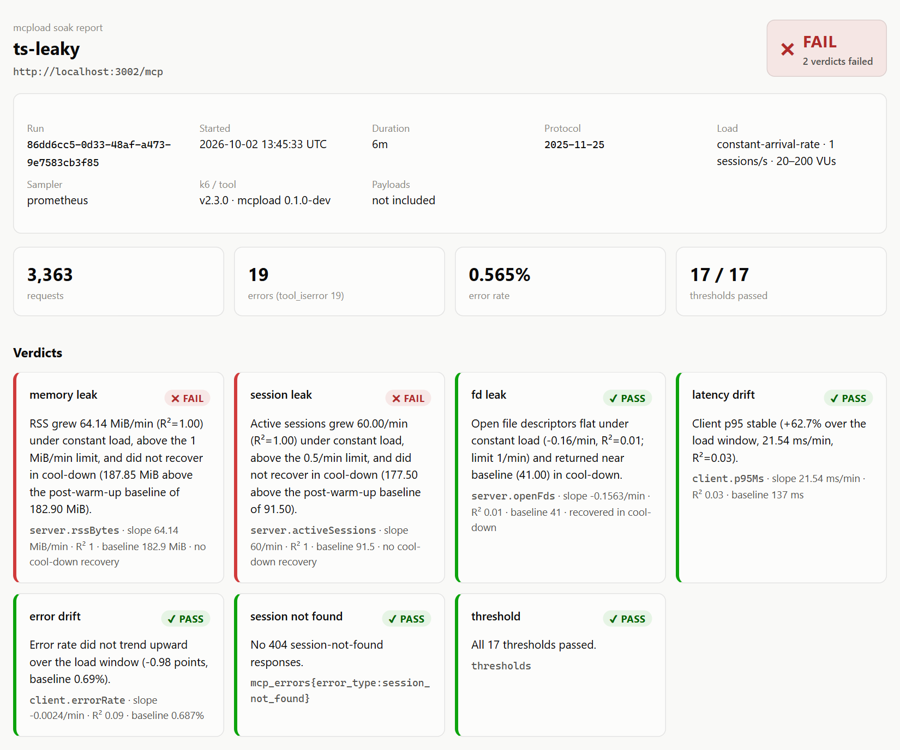
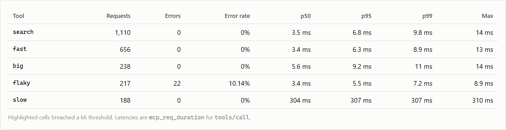

# mcpload

**Find out whether your MCP server can handle real AI-agent traffic, before your users find out it can't.**

[](https://github.com/atul121001/mcpload/actions/workflows/ci.yml)
[](LICENSE)

mcpload is a free, open-source reliability test harness for MCP servers, built around how AI agents actually behave. It doesn't just fire requests at an endpoint: it runs agent sessions that discover tools, call several of them in parallel, use the results to decide what to call next, and answer the server's own questions mid-call. It watches how the server holds up over time and gives you a plain pass or fail with the reasons.



One command is all it takes:

```bash
./mcpload run --url https://your-server.example.com/mcp
```

> **Status:** early release. Commands and options may change before 1.0.

---

## Why you'd want this

An MCP server is how AI agents use your product. Agent traffic is not like normal API traffic. A classic load test sends one request, waits for the answer, and sends the next. An agent works more like this:

```text
open session ─► list tools
   ─► search ┐
   ─► fetch  ├─ at the same time
   ─► fetch  ┘
   ─► pause to decide ─► call tools built from those results ─► pause ─► ...
   ─► close session
```

It keeps a session open, fans out several tool calls at once, and each step depends on the one before. If the server slows down, leaks memory, or loses sessions, every agent that depends on it fails.

Problems like these usually don't show up in a quick manual test. They show up after an hour of real traffic, or once you put two servers behind a load balancer. mcpload is built to catch them before release.

## What it checks

| The question you have | What mcpload does |
|---|---|
| **Can my server handle many agents at once?** | Simulates many agents opening sessions, listing tools and calling tools in parallel, then measures speed and errors for **each tool separately**. |
| **How many agents can it take before it breaks?** | `mcpload capacity --from 10 --to 1000` raises the number of agents step by step, tells you the last level where every tool stayed within budget and which tool broke first, and estimates the capacity in between (e.g. "~250 agents"). |
| **Do real multi-step tasks stay fast?** | Runs agents through a plan where each step's calls are built from the previous step's results, and times every step and the whole task. |
| **Does one slow tool hold up the others?** | Compares each tool's speed alone and mixed with your slow tools, to catch a shared pool or a blocked event loop. |
| **Do sampling and elicitation work under load?** | Answers the server's mid-call requests (sampling, elicitation, roots) with a configurable delay, like a real client waiting on an LLM or a person. |
| **Does it slowly run out of memory?** | Runs a long test (30–60 minutes is typical), samples the server's memory as it goes, and tells you if memory keeps climbing and never comes back down. |
| **Does it lose sessions behind a load balancer?** | Spots the classic "session not found" failure when requests from one agent land on different servers. |
| **What happens during a rolling deploy?** | Puts agents on replicas running different builds and tells you whether a mismatch fails fast with a clear error or leaves clients hanging until they time out. |
| **What if the server restarts mid-run?** | Restarts your server's container during the test (`--chaos-restart`), measures how long until agents are served again, and counts tool calls that were lost or **ran twice**. |
| **Do long-lived agent sessions survive?** | Keeps one session per agent open for many minutes and reports sessions the server dropped while they were still in use. |
| **Does the server stop work when an agent cancels?** | Cancels a share of tool calls and checks, from the server's own metrics, whether the cancelled work actually stopped or kept using capacity. |
| **Is it ready for the newer stateless MCP spec?** | Speaks both the older session-based protocol and the stateless 2026-07-28 protocol, and picks the right one automatically. |
| **Do logins survive under load?** | Tests OAuth token refresh with many agents at once. |
| **Did my latest change make it slower?** | Runs in CI on every pull request and fails the build if a tool goes over its time or error budget. |

## How it compares

Testing an MCP server means answering four different questions. Most tools answer one of them well. mcpload is built for the fourth one.

| The question | Tools built for it | What they don't tell you |
|---|---|---|
| **Does my server work?** One client, one request at a time. | [MCP Inspector](https://github.com/modelcontextprotocol/inspector), [MCPJam](https://www.mcpjam.com/) | What happens with 100 agents at once. |
| **Does the agent pick the right tool and finish the task?** | [mcp-eval](https://github.com/lastmile-ai/mcp-eval), [mcpbr](https://mcpbr.org/), agent eval platforms | Whether the server stays fast and up under load. |
| **How fast is one endpoint under load?** | k6, JMeter, Locust, Gatling, Artillery | Nothing about MCP: no sessions, tool lists or tool calls, so they can't reproduce agent traffic. |
| **Will it hold up when many real agents use it, for hours?** | **mcpload** | |

### Side by side with the other MCP load tools

Three other projects send MCP traffic under load. This table comes from each project's own README (checked October 2026). "Not in docs" means we couldn't find it documented, not that it can't be built on top.

| | **mcpload** | [JMeter MCP plugin](https://github.com/Blazemeter/jmeter-mcp-plugin) (BlazeMeter) | [xk6-mcp](https://github.com/dgzlopes/xk6-mcp) (k6) | [mcp-bench](https://pkg.go.dev/github.com/tmc/mcp/exp/cmd-experimental/mcp-bench) |
|---|---|---|---|---|
| **Status** | Early release (v0.3) | v0.1.0 | Experimental, "not officially supported by Grafana Labs" | Experimental Go command |
| **How you use it** | One command with ready-made scenarios | JMeter GUI test plan (Java 17+) | Write a k6 script | CLI |
| **MCP sessions** | One per simulated agent, each with its own session ID | **One shared client for the whole test run**; every thread uses the same session | One per client your script creates | Concurrent clients |
| **Several tool calls at once inside one session** | ✅ `callParallel` | ❌ synchronous client, one call per thread | ❌ `callTool` returns before the next call | Not in docs |
| **Next call built from the previous result** | ✅ `agent-workflow` scenario with `$from` references | Possible with JMeter extractors, by hand | Possible in your script, by hand | ❌ |
| **Latency per tool** | ✅ p50/p95/p99 and error rate for every tool | ✅ one sampler per tool | ❌ metrics are tagged by `method` only, so every `tools/call` is mixed together | Not in docs |
| **Budget per tool, with PASS/FAIL** | ✅ `P95_MS`, `TOOL_BUDGETS` | With assertions you configure | ❌ no per-tool tag to set a threshold on | ❌ exports results, no pass/fail |
| **"How many agents can it take?"** | ✅ `mcpload capacity`: a step table with tail latency and error classes, "breaks budget: `slow` p95 1.26 s > 800 ms" at 20 agents, "Estimated sustainable capacity: ~13 agents" | Ramp threads and read the graphs yourself | Ramp VUs and read the graphs yourself | Stress mode that scales up |
| **Does one slow tool block the others?** | ✅ `isolation` scenario and verdict | ❌ | ❌ | ❌ |
| **Leak detection** | ✅ memory, sessions and open files; slope over steady load plus a cool-down check; Docker or Prometheus | ❌ | ❌ | Watches memory, goroutines and GC of the server process |
| **Load balancer "session not found"** | ✅ dedicated scenario and verdict | ❌ one shared session can't reproduce it | ❌ | ❌ |
| **Cost of opening sessions (initialize floods)** | ✅ `burst` scenario, connect time measured on every session | ❌ connect and `initialize` are excluded from sample time and happen once | Measured if your script reconnects | Not in docs |
| **Sampling / elicitation requests from the server** | ✅ answered with a configurable delay | Not in docs | Not in docs | Not in docs |
| **Rolling deploy: replicas on different builds** | ✅ `version-skew`: fail-fast vs hang verdict | ❌ | ❌ | ❌ |
| **Server restart mid-run: recovery time** | ✅ `--chaos-restart` and `recovery` verdict | ❌ | ❌ | ❌ |
| **Lost or duplicated tool calls** | ✅ `call_integrity`: what the client saw vs what the server ran | ❌ | ❌ | ❌ |
| **Cancellation: does the server stop the work?** | ✅ `cancellation` verdict from server metrics | Not in docs | Not in docs | Not in docs |
| **Long-lived sessions dropped early** | ✅ `long-lived` scenario and `session_survival` verdict | ❌ | ❌ | ❌ |
| **Auth** | Bearer token, OAuth client credentials with shared refresh | Not in docs | Not in docs | Not in docs |
| **Stateless 2026-07-28 protocol** | ✅ auto-detected | Not in docs | Not in docs | Not in docs |
| **CI** | ✅ GitHub Action with a PR comment and HTML report | `jmeter -n` plus assertions | `k6 run` plus thresholds | Export to other tools |
| **Resources and prompts** | ❌ tools only | ✅ | ✅ | Not in docs |
| **stdio and SSE servers** | ❌ streamable HTTP only | ✅ | ✅ | ✅ |

### What that means in practice

- **Session bugs only show up with many sessions.** The JMeter plugin shares one MCP client across all threads, so 100 threads look like one very busy agent. It can't show you sessions piling up in memory, or a load balancer sending an agent's second request to a replica that never saw its session. mcpload gives every simulated agent its own session, so both show up.
- **Agents call tools in parallel.** A real agent fires off `search`, `fetch` and `fetch` at once and waits for all three. JMeter's synchronous client and xk6-mcp's `callTool` send one call at a time. mcpload's `callParallel` sends them together, which is what fills a shared connection pool or blocks an event loop.
- **"The server is slow" isn't actionable. "`search` is slow" is.** xk6-mcp tags its metrics only by `method`, so a 10 ms tool and a 2 s tool end up in the same number. mcpload reports and budgets every tool separately, and the CI check names the tool that broke.
- **The worst production failures happen during deploys and restarts.** A rolling deploy puts two builds behind one load balancer; a restart drops every in-flight call. mcpload tests both and tells you whether clients get a clear error or hang, how long recovery takes, and whether any tool call was lost or executed twice. The other tools only measure a server that stays up.
- **You get an answer, not a graph.** Every mcpload run ends with PASS or FAIL and a sentence saying why, such as "max sustainable concurrency: 10 agents (budgets broke at 20)" or "RSS grew 64 MiB/min and did not recover in cool-down". With the other tools you collect the numbers and decide yourself.

### When to use something else

- Use **MCP Inspector or MCPJam** to debug a single request.
- Use **mcp-eval or mcpbr** to check that agents pick the right tools.
- Use **the JMeter plugin or xk6-mcp** to load-test resources and prompts, or local stdio servers. mcpload doesn't do those yet.

These tools work well alongside mcpload.

## Which test should I run?

| When | Run | How long |
|---|---|---|
| On every pull request | `agent-session` (the default) in CI, with per-tool budgets | 1–2 min |
| Before a release | `mcpload capacity` to find how many agents you can take, then `soak` with a sampler to catch leaks | 10–60 min |
| You run more than one replica | `lb-check`, then `version-skew` with two builds behind the load balancer | 2–5 min |
| You changed timeouts, restarts or deploys | `reconnect-storm` with `--chaos-restart`, plus `--calls-url` to count lost and duplicated calls | 2–5 min |
| Agents keep sessions open for long | `long-lived` | 10+ min |
| Your tools are slow or cancellable | `isolation`, and `agent-session` with `CANCEL_RATE` | 2–5 min |

Every option is in [scenarios/README.md](scenarios/README.md).

## What you get

Every run ends with a clear verdict in the terminal, an exit code your CI understands, and a report you can open in any browser (`report.html`) or keep as data (`report.json`).

The images below are from real 6-minute runs against two of the bundled demo servers: one healthy, and one with a deliberate memory leak.

**A server with a memory leak.** Under steady load, memory climbs in a straight line. When the load stops (the blue "cool-down" area on the right), it stays up. mcpload marks this as a fail.



**A healthy server.** Memory settles after warm-up and stays flat. Marked as a pass.



The terminal tells the same story in words:

```text
  FAIL     memory_leak        RSS grew 64.14 MiB/min (R²=1.00) under constant load, above the 1 MiB/min limit,
                              and did not recover in cool-down (187.85 MiB above the post-warm-up baseline).
  FAIL     session_leak       Active sessions grew 60.00/min (R²=1.00) under constant load, above the 0.5/min
                              limit, and did not recover in cool-down.
  PASS     fd_leak            Open file descriptors flat under constant load.
  PASS     latency_drift      Client p95 stable.
  PASS     error_drift        Error rate did not trend upward over the load window.
  PASS     session_not_found  No 404 session-not-found responses.
  PASS     threshold          All 17 thresholds passed.
mcpload result: FAIL
```

(Long lines are wrapped and some messages shortened here.)

In plain words: memory and open sessions kept growing while the load stayed the same, and they didn't drop after the load stopped. Note that every speed budget passed. A leak like this doesn't show up in a short test; it shows up in production, hours later.

<details>
<summary><b>See more of the report</b></summary>

The top of the report: overall result, run details, and a card for every check.



Speed and errors for each tool, from the healthy run. Any cell over its budget is highlighted.



</details>

---

## Try it in 5 minutes

The repo includes small demo MCP servers, some healthy and some deliberately broken, so you can see both a pass and a fail without touching a real server.

**You need:** [Docker](https://docs.docker.com/get-docker/) (to run the demo servers) and Git. No programming tools are needed.

**1. Get the code.** This includes the demo servers and ready-made test scenarios.

```bash
git clone https://github.com/atul121001/mcpload.git
cd mcpload
```

**2. Download mcpload into that folder.** Each download contains two programs: `mcpload` (the command you use) and `k6` (the load generator, with MCP support built in).

| Your computer | Download from [Releases](https://github.com/atul121001/mcpload/releases/latest) |
|---|---|
| Windows | `mcpload_<version>_windows_amd64.zip` |
| Mac with Apple silicon (M1 or newer) | `mcpload_<version>_darwin_arm64.tar.gz` |
| Mac with Intel | `mcpload_<version>_darwin_amd64.tar.gz` |
| Linux | `mcpload_<version>_linux_amd64.tar.gz` |

Unpack it and move `mcpload` and `k6` into the `mcpload` folder you cloned. On Mac or Linux you can do it in one line from that folder (here for version 0.3.0).

Linux (Intel/AMD):

```bash
curl -fL https://github.com/atul121001/mcpload/releases/download/v0.3.0/mcpload_0.3.0_linux_amd64.tar.gz \
  | tar -xz --strip-components=1 'mcpload_0.3.0_linux_amd64/mcpload' 'mcpload_0.3.0_linux_amd64/k6'
```

Mac with Apple silicon:

```bash
curl -fL https://github.com/atul121001/mcpload/releases/download/v0.3.0/mcpload_0.3.0_darwin_arm64.tar.gz \
  | tar -xz --strip-components=1 'mcpload_0.3.0_darwin_arm64/mcpload' 'mcpload_0.3.0_darwin_arm64/k6'
```

For another platform, replace `linux_amd64` or `darwin_arm64` in all three places (for example `darwin_amd64` for an Intel Mac, `linux_arm64` for ARM Linux).

> **Mac:** if macOS says the app "cannot be opened because the developer cannot be verified", run `xattr -d com.apple.quarantine mcpload k6` once in the folder.

**3. Start the demo servers.** They run only on your own machine (127.0.0.1).

```bash
docker compose -f demo-servers/docker-compose.yml up -d --build
```

**4. Test a healthy server.** One minute of agent traffic:

```bash
./mcpload run --url http://localhost:3001/mcp --duration 1m --html report.html
```

With no `--scenario`, mcpload runs the standard agent-session test.

You should see a **PASS**. Open `report.html` in your browser to see per-tool timings.

**5. Now test a broken one.** This server sits behind a load balancer that forgets which agent belongs to which server:

```bash
./mcpload run --url http://localhost:3004/mcp --scenario lb-check --html lb.html
```

You should see a **FAIL** with `session_not_found`. That's the tool catching a real class of bug.

> **On Windows,** use `.\mcpload.exe` in place of `./mcpload`. [docs/QUICKSTART.md](docs/QUICKSTART.md) has PowerShell versions of everything.

<details>
<summary><b>Prefer to build from source?</b></summary>

You need [Go 1.26+](https://go.dev/dl/). From the repo folder:

```bash
go install go.k6.io/xk6@latest
xk6 build --with github.com/atul121001/mcpload/xk6-mcpload=./xk6-mcpload --output ./k6
(cd cmd/mcpload && go build -o ../../mcpload .)
```

</details>

When you're done: `docker compose -f demo-servers/docker-compose.yml down`

---

## Test your own server

> **Only test servers you own, or have written permission to test.** Start with a staging server, not production.

**1. Point it at your server.** Use your server's MCP URL. If it needs a login token, pass it with `--env`:

```bash
./mcpload run --url https://staging.example.com/mcp \
  --env MCP_TOKEN=your-token \
  --vus 5 --duration 2m --html report.html
```

`--vus 5` means 5 simulated agents at the same time. Start small and raise it step by step.

**2. Choose which tools to call.** By default mcpload calls **every tool your server lists**, with sample arguments. If any of your tools change data (create, update, delete, send, pay), limit the test to safe, read-only tools:

```bash
--env 'TOOL_MIX={"search":5,"get_document":3}'                    # tools to call, and how often
--env 'TOOL_ARGS={"search":{"query":"invoices"},"get_document":{"id":"42"}}'   # their arguments
```

If you name a tool in `TOOL_MIX` that your server doesn't list (a typo, say), mcpload prints a warning and records a failed check, so a misspelled tool shows up in the result instead of quietly going untested.

> **Windows PowerShell 5.1** (the `powershell` that comes with Windows) strips the double quotes out of JSON before mcpload sees it. Escape each one with a backslash there: `--env 'TOOL_MIX={\"search\":5,\"get_document\":3}'`. PowerShell 7.3 or newer (`pwsh`) passes the quotes correctly, so use the plain form above, the same as on Mac or Linux.

**3. Set your budgets.** Decide how fast "fast enough" is:

```bash
--env P95_MS=800 --env P99_MS=2000 --env ERR_RATE=0.01
```

That means: 95% of calls under 800 ms, 99% under 2 seconds, and fewer than 1% errors, **for every tool the test calls**. Each tool is judged on its own; one slow tool can't hide behind fast ones. Speed is measured over the calls that succeeded, and failed calls count toward the error rate.

To give one tool different limits, use `TOOL_BUDGETS`. Tools you don't mention keep the defaults above:

```bash
--env 'TOOL_BUDGETS={"generate_report":{"p95":3000,"p99":6000}}'
```

**4. Look for leaks with a long run.** A soak test keeps the load steady for a while, then stops (the "cool-down") and checks that the server recovers. Leak checks only run on soak tests: a short test can't tell a leak from a server that's still warming up, so on a normal run they show as skipped. Plan on **at least 10 minutes** of steady load; shorter soaks only reliably catch fast leaks (around 2 MiB per minute or more).

For memory checks, mcpload also needs a way to read your server's memory. You can use either of these:

- your server's Prometheus metrics endpoint (`--sampler prometheus --prom-url .../metrics`), or
- the Docker container it runs in (`--sampler docker --container my-mcp-server`).

```bash
./mcpload run --url https://staging.example.com/mcp --scenario soak \
  --env MCP_TOKEN=your-token --soak-min 30 \
  --sampler prometheus --prom-url https://staging.example.com/metrics \
  --out soak.json --html soak.html
```

The soak starts 2 new agent sessions per second by default. Change it with `--env RATE=...`; fractions work too, so `--env RATE=0.05` means one new session every 20 seconds, a gentle pace for a small staging server.

Without a sampler, mcpload still reports speed and error trends, but it can't judge memory. If your Prometheus endpoint also reports heap size (as Node, Go and Python clients usually do), the memory check looks at the heap as well as total memory.

### Find your capacity

Instead of running `--vus 10`, then 50, then 100 by hand, let mcpload step through them in one run:

```bash
./mcpload capacity --url https://staging.example.com/mcp --env MCP_TOKEN=your-token \
  --from 10 --to 1000 --step-duration 1m --refine 2 --html capacity.html
```

It runs 10, 20, 40, ... agents up to `--to` (`--factor` changes the ratio, `--steps 10,25,50` sets them yourself), holds each level for `--step-duration`, judges every step against your budgets, and stops early once the server has clearly fallen over. A real run against the demo server with a small connection pool, with a 1 s client timeout (`--from 5 --to 40 --step-duration 15s --env MCP_TIMEOUT=1s`):

```text
mcpload capacity steps (p95/p99: all tools/call; errors: all requests):
  Agents     p95     p99  Errors             req/s  Slowest tool p95
       5  306 ms  413 ms  0.31%               42.2  slow 529 ms
      10  513 ms  643 ms  0.41%               78.7  slow 673 ms
      20  849 ms  941 ms  1.38% timeout 8    108.3  slow 966 ms       <- breaks budget: `slow` error rate 6.93% > 1%, all `timeout` (+5 more)
      40  984 ms  997 ms  7.06% timeout 153  148.8  flaky 989 ms      over budget: `slow` error rate 68.39% > 1%, all `timeout` (+8 more)
max sustainable concurrency: 10 agents (budgets broke at 20)
Estimated sustainable capacity: ~11 agents (between 10 (held) and 20 (broke); linear interpolation of `slow` error rate to its 1% budget (the lowest of 6 breached metrics); an estimate, not a measured step)
```

The Errors column shows the error rate and the most frequent error classes. Tool errors from a tool failing within its own error budget (here the demo `flaky` tool) are counted in the rate but not named.

The estimate follows each breached metric in a straight line from the last step that held to the first that broke, and takes the earliest crossing of its budget. `--refine 2` then measures two more steps inside that gap (in a second k6 run) to narrow it. Add `--target 200` to fail the run when the server can't hold 200 agents. Details in [cmd/mcpload/README.md](cmd/mcpload/README.md#capacity).

Every option is listed in [scenarios/README.md](scenarios/README.md) and [cmd/mcpload/README.md](cmd/mcpload/README.md).

## Getting trustworthy results

A load test measures the server *and* the computer sending the load. A few habits keep the numbers honest:

- **Run mcpload on a different machine from the server**, or at least on different CPU cores. If both fight over the same CPU, a healthy server can look slow.
- **Start small.** Begin with a few agents and a short run, check that everything passes, then raise the load step by step. That way you learn where the server starts to struggle instead of just seeing a wall of errors.
- **Hunt leaks with a long soak and a sampler.** Use at least 10 minutes of steady load (30–60 is better) with `--sampler docker` or `--sampler prometheus`. Without a sampler there's nothing to judge memory by.
- **Watch the `generator` check.** It tells you when the load generator itself was the bottleneck: it couldn't send all the traffic you asked for, or it was using most of its CPU. If it warns or fails, the speed numbers may be partly the test machine's fault, not the server's. Give mcpload a bigger machine or lower the load, and run again.

---

## Reading the result

| You see | It means |
|---|---|
| **PASS**, exit code `0` | Every check and every budget passed. |
| **FAIL**, exit code `1` | At least one check or budget failed. The report says which, and why. |
| exit code `2` | The test itself couldn't run, for example a wrong URL or k6 not found. |

The checks, in plain words:

| Check | Fails when… |
|---|---|
| `memory_leak` | Memory keeps rising under steady load and doesn't come back down afterwards. Soak tests only. |
| `session_leak` | Open sessions pile up and aren't cleaned up. Soak tests only. |
| `fd_leak` | Open files or connections pile up. Soak tests only. |
| `latency_drift` | A tool gets noticeably slower the longer the test runs (a warning). Each tool is checked separately. |
| `error_drift` | Errors become more frequent over time (a warning). |
| `session_not_found` | The server "forgets" an agent's session, which often means a load-balancer problem. |
| `threshold` | A tool went over your time or error budget. |
| `generator` | The test machine couldn't keep up: it dropped more than 1% of the planned load (a warning) or more than 10% (a fail), or k6 itself went over 90% CPU at its busiest, so the speed numbers may include the test machine's own delay. See [Getting trustworthy results](#getting-trustworthy-results). |
| `version_skew` | Version-skew runs only: requests that reached a replica on a different build. A warning when they all fail fast with a typed error clients can handle (e.g. `Unsupported protocol version`), a fail when any of them hangs until the client timeout. |
| `capacity` | `mcpload capacity` and step-load runs only: how many agents at once the server held within your time and error budgets, and what broke at the next step, e.g. "Held budgets up to 50 agents; at 100 agents `slow` p95 1.9 s > 800 ms". Fails if your `--target` (`--min-agents` with `run`) isn't met (or, without a target, if even the first step breaks). Says "inconclusive" instead of blaming the server when the test machine was maxed out. |
| `session_survival` | Long-lived runs only: fails when sessions die before their planned end, e.g. "18 of 50 sessions died after a median 5m02s with session_not_found"; warns when calls late in a session are much slower than early ones. |
| `recovery` | Runs with `--chaos-restart`: how long the server took to serve normally again after mcpload restarted its container, e.g. "20 agents reconnected within 2.0 s; errors returned to under 1% 2.0 s after the restart (budget 30 s)". Fails over `RECOVERY_BUDGET`. |
| `call_integrity` | Runs whose calls carry call ids, with `--calls-url`: fails when the server ran a call twice (a client retry or a racy duplicate check), warns when calls failed on the client but ran on the server. |
| `cancellation` | Runs that cancelled calls (`CANCEL_RATE`, or timeouts) only: whether the server stops work it was told to cancel, e.g. "The server kept running `slow` for a median 2.1 s after 480 cancels: cancelled work still uses capacity". Needs `--sampler prometheus` and a server that exposes `mcp_work_after_cancel_seconds` (the TS demo server does) to judge the server side: a warning from a median of 100 ms of work after a cancel, a fail from 1 s. Without it, it reports what the client saw (cancels sent, late responses) and warns when more than 10% of cancelled calls still got a response. |

"Soak tests only" means the check is skipped on short runs without a cool-down, or with less than 2 minutes of steady load.

---

## Run it on every pull request

The GitHub Action builds everything, runs the test, posts a pass/fail summary with a per-tool table on the pull request, and saves the report as a download.

```yaml
jobs:
  mcp-load:
    runs-on: ubuntu-latest
    permissions:
      contents: read
      pull-requests: write          # only needed for the PR comment
    steps:
      - uses: actions/checkout@v4
      - run: docker compose up -d --build        # start your MCP server
      - uses: atul121001/mcpload-action@v1
        with:
          url: http://localhost:8080/mcp
          wait-ready: 2m                # wait until the server answers an MCP handshake
          scenario: agent-session
          vus: '10'
          duration: 2m
          p95-ms: '800'
          p99-ms: '2000'
          err-rate: '0.01'
          comment-on-pr: 'true'
```

`atul121001/mcpload-action` is the [GitHub Marketplace](https://github.com/atul121001/mcpload-action) entry for this repo's action. To pin an exact mcpload version, use `atul121001/mcpload/action@v0.3.0` instead. All inputs and outputs are documented in [action/action.yml](action/action.yml). If your server takes a while to start (loading models, filling connection pools), `wait-ready` (CLI: `--wait-ready 2m`) holds the test until it answers, and fails the step with exit code 2 if it never does. Working examples: [PR gate](.github/workflows/example-pr-gate.yml) and [nightly soak](.github/workflows/example-nightly-soak.yml).

---

## Show that your server is tested

If you run mcpload against your MCP server (for example in CI), you can add this badge to your server's README:

[](https://github.com/atul121001/mcpload)

```markdown
[](https://github.com/atul121001/mcpload)
```

The badge says that you test with mcpload. It doesn't show a live result, so keep the test running in CI to keep it honest.

---

## Common questions

**Do I need to know k6?**
No. The ready-made scenarios cover the common cases, and you control them with flags and `--env` settings. If you do know k6, you can write your own scripts (see below).

**Will it break my server?**
It can, if you push it hard. That's the point of a load test, so use staging and start with a few agents. Be careful with tools that change data: limit the test with `TOOL_MIX`.

**Does it send my data anywhere?**
No. Everything runs on your machine or your CI runner. Reports stay local unless you pass `--upload-url` to send one to a server you choose. Tool arguments and results aren't stored in reports.

**Which MCP servers does it work with?**
Remote MCP servers over streamable HTTP, in any language. It has been tested against servers built with the official TypeScript, Python and Go SDKs. Local stdio servers aren't supported.

**How long should a soak test be?**
30–60 minutes catches most slow leaks, and 10 minutes of steady load is a sensible minimum. A few minutes is enough to check that everything is wired up, but leak checks are skipped below 2 minutes of steady load, and a short soak only catches fast leaks.

**Does it run a real LLM?**
No. The agents follow scripted plans, so runs are repeatable and cost nothing. Pauses stand in for the time an agent spends thinking, and answers to sampling requests are canned replies with a delay you choose. Your real agents may call tools in a different order, so write your own plan with `--env WORKFLOW=...` if the default doesn't look like your traffic.

**How is it different from JMeter or other k6 MCP extensions?**
See [How it compares](#how-it-compares). In short: those give you an MCP client to build tests with; mcpload ships the agent traffic model (parallel calls, multi-step plans, sampling answers) and the verdicts on top of it.

---

## For advanced users

<details>
<summary><b>Write your own scenarios (JavaScript)</b></summary>

mcpload's MCP support is a k6 extension, so you can script any traffic pattern:

```js
import mcp from 'k6/x/mcpload';

const client = new mcp.Client({
  url: __ENV.MCP_URL,
  protocol: 'auto',                       // or '2026-07-28', '2025-11-25', ...
  auth: { type: 'bearer', token: __ENV.MCP_TOKEN },
});

export const options = {
  vus: 10, duration: '1m',
  thresholds: { 'mcp_req_duration{tool:search}': ['p(95)<800'], 'mcp_tool_error_rate': ['rate<0.01'] },
};

export default function () {
  const s = client.connect();
  s.listTools();
  s.callParallel([{ name: 'search', args: { query: 'invoices' } }, { name: 'fast', args: {} }]);
  s.close();
}
```

Full API: [xk6-mcpload/README.md](xk6-mcpload/README.md).
</details>

<details>
<summary><b>Metrics</b></summary>

| Metric | Type | What it measures |
|---|---|---|
| `mcp_req_duration` | Trend | each JSON-RPC round trip (tagged by `method`, `tool`, `status`, `error_type`) |
| `mcp_req_ttfb` | Trend | time to the first response byte |
| `mcp_stream_duration` | Trend | SSE responses: headers to matching event |
| `mcp_connect_duration` | Trend | the whole `connect()` (`initialize` or `server/discover`) |
| `mcp_oauth_refresh_duration` | Trend | OAuth token fetch |
| `mcp_reqs` | Counter | requests |
| `mcp_errors` | Counter | errors by `error_type`: `http`, `jsonrpc`, `tool_iserror`, `timeout`, `session_not_found`, `header_mismatch`, `auth` |
| `mcp_tool_error_rate` | Rate | failed `tools/call` (including `isError: true`) |
| `mcp_sessions_open` | Gauge | client-side open sessions |
| `mcp_server_requests` | Counter | server-to-client requests (sampling, elicitation, ...) answered inside response streams, by `method`; unexpected ones count in `mcp_errors` as `unsupported_request` |
| `mcp_server_request_duration` | Trend | time to answer a server-to-client request (includes the simulated `delayMs`) |
| `mcp_cancellations` | Counter | cancelled calls by `reason` (`client`: `cancelAfterMs`; `timeout`) and `outcome` (`cancelled`, `late_response`, `send_failed`, or `completed` when the call beat its cancel deadline). Cancelled calls carry `error_type` `cancelled` in `mcp_reqs` but are not counted in `mcp_errors` |
| `mcp_cancel_duration` | Trend | time to send a cancel (the `notifications/cancelled` POST, or closing the stream on 2026-07-28) |
| `mcp_cancel_late_response` | Trend | cancel sent to a late response arriving anyway (stateful only) |

Report format: [report/schema/README.md](report/schema/README.md).
</details>

<details>
<summary><b>Built-in scenarios</b></summary>

| Scenario | What it simulates |
|---|---|
| `agent-session.js` | Agents opening a session, listing tools and calling several in parallel, with pauses in between. |
| `agent-workflow.js` | Agents working through a multi-step plan: parallel calls, a pause to decide, then calls built from the earlier results. Reports each step's time and the whole workflow's time. Set your own plan with `--env WORKFLOW=...`. |
| `burst.js` | A sudden rush of new agents, including a flood of session starts. |
| `soak.js` | Steady traffic for a long time, then a quiet period, to find leaks. |
| `lb-check.js` | Session handling behind a load balancer. |
| `isolation.js` | Whether fast tools wait behind slow ones (a shared connection pool, worker pool or blocked event loop). Name your slow tools with `--env SLOW_TOOLS=...`. |
| `version-skew.js` | A rolling deploy caught halfway: replicas on two builds behind one load balancer. Reports whether mismatched requests fail fast with a typed error or hang until the timeout. Add `--env TOOLS_CACHE_TTL=5m` to reuse an earlier tool list. |
| `step-load.js` | More and more agents at once, in steps (10, 25, 50, 100, 200 by default), to find the breaking point. Set the steps with `--env STEPS=...` and a target with `--min-agents`. |
| `long-lived.js` | Agents that each keep one session open for a long time (10 minutes by default), calling tools now and then and pinging when quiet, to catch servers that drop live sessions or slow down as a session ages. |
| `reconnect-storm.js` | Agents that reconnect as soon as their session breaks. With `--chaos-restart` mcpload restarts the server mid-run and measures how fast it recovers, and with `--calls-url` whether any call was lost or ran twice. Only on servers you own. |
| `oauth-refresh.js` | Many agents sharing short-lived login tokens. |

Settings for each: [scenarios/README.md](scenarios/README.md).
</details>

<details>
<summary><b>Repository layout</b></summary>

| Path | What |
|---|---|
| [`xk6-mcpload/`](xk6-mcpload/README.md) | the k6 extension that speaks MCP (Go) |
| [`cmd/mcpload/`](cmd/mcpload/README.md) | the `mcpload` command: runs k6, samples the server, computes verdicts, writes the report |
| [`scenarios/`](scenarios/README.md) | ready-made test scenarios |
| [`report/`](report/schema/README.md) | report format, validator and HTML report |
| [`demo-servers/`](demo-servers/README.md) | healthy and deliberately broken demo servers (local-only, intentionally vulnerable) |
| [`action/`](action/action.yml) | the GitHub Action |
</details>

---

## Learn more

- [Quick start for Windows, Linux and macOS](docs/QUICKSTART.md)
- [How it works (architecture)](docs/ARCHITECTURE.md)
- [Calibration results and recommended budgets](docs/CALIBRATION.md)
- [Roadmap](docs/ROADMAP.md)
- [Contributing](CONTRIBUTING.md)

## License

[Apache-2.0](LICENSE)
